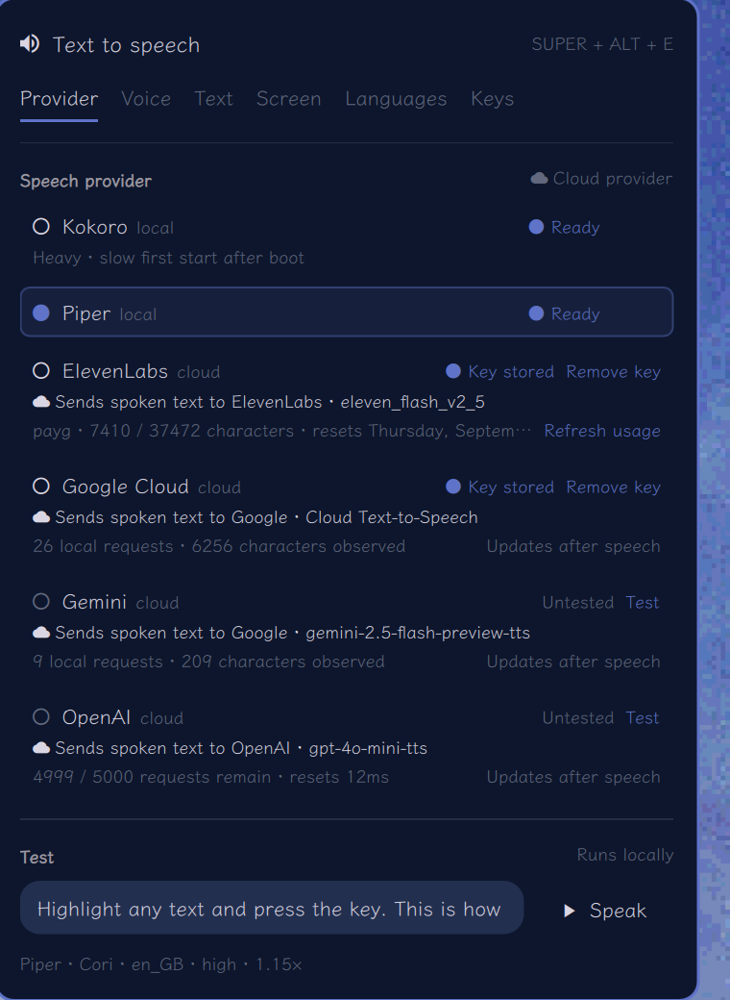
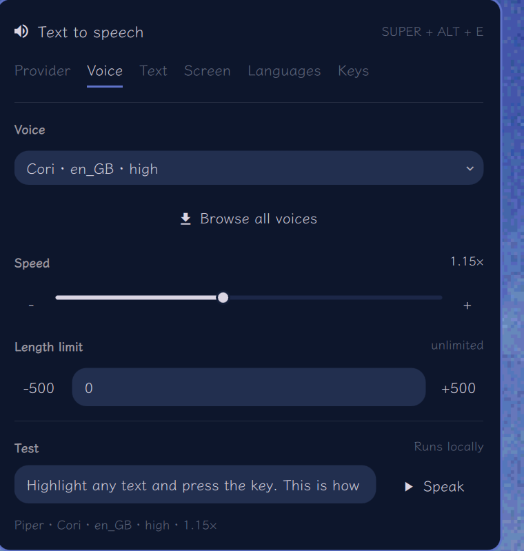
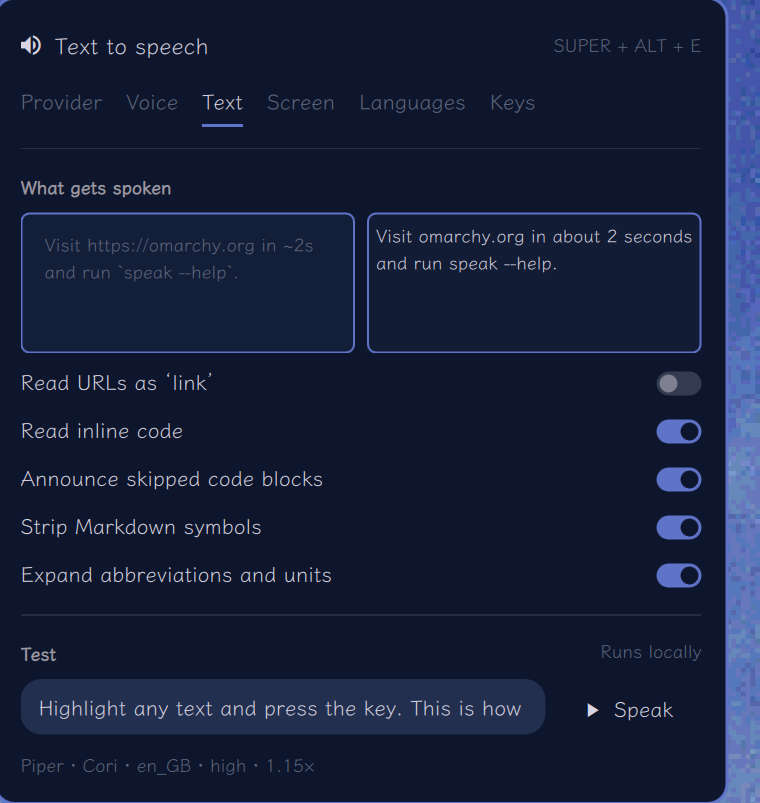
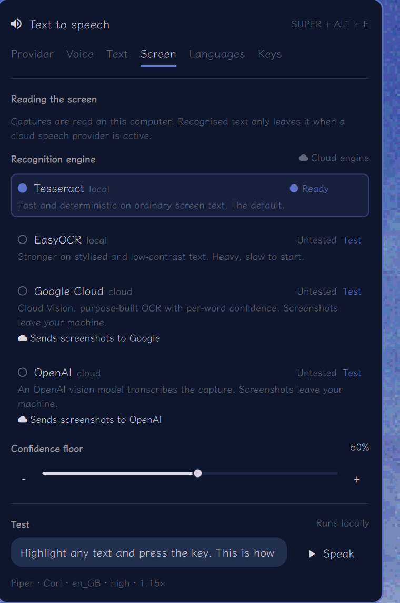
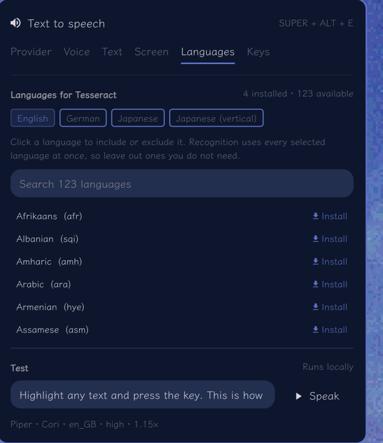
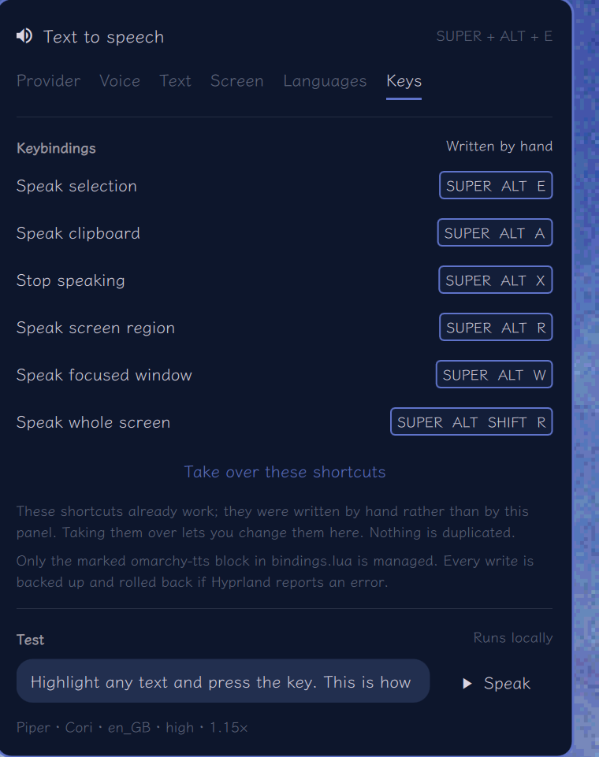

# Omarchy TTS

[](https://github.com/hikari112/omarchy-tts/actions/workflows/ci.yml)
[](LICENSE)
[](https://omarchy.org/)

**Anything on your screen can speak.**

Omarchy TTS turns speech into a desktop command: indicate something, hear it,
then stop. Read a selection, the clipboard, a clipboard image, a window, the
focused monitor, or a region you draw around otherwise unreachable text.

> Not a screen reader. Not a reading platform. Just a hotkey that makes the
> thing in front of you speak.

It is on-demand, local-first, and app-independent. Piper is the on-device
default; cloud providers are optional voices, never silent dependencies. There
is no narration mode, required account, subscription, browser extension, or
text import workflow.

<p align="center">
  
</p>

## Why this exists

Sometimes you do not want the entire desktop narrated. You want *this paragraph*,
*this dialog*, or *this tiny line of game text* read once, immediately. Omarchy
TTS keeps that interaction consistent even when the source changes:

| What you indicate | What the plugin does |
|---|---|
| Selected or copied text | Reads the text directly |
| A copied image | Runs OCR (local by default), then reads the result |
| A dragged region | Captures those pixels, runs OCR, then reads them |
| The focused window or monitor | Captures it without requiring pointer precision |

This is assistive desktop reading for dyslexia, ADHD, low vision, eye strain,
reading fatigue, dense documentation, scanned PDFs, and unvoiced game text. It
complements structural screen readers such as Orca; it does not provide desktop
navigation, control semantics, or Braille support.

## Install

```bash
omarchy plugin add https://github.com/hikari112/omarchy-tts.git --enable
```

Click the speaker in the bar. The welcome screen installs the recommended
local engine and voice; the **Keys** tab installs the shortcuts. Both are
guided, cancellable operations—no terminal setup or manual config editing.

## Requirements

The base plugin uses `bash`, `wl-clipboard`, `jq`, `python3`, `flock`
(util-linux), and PipeWire or ALSA. Screen-reading modes additionally use
`tesseract`, `grim`, `slurp`, and optionally `hyprpicker`. Cloud providers use
`curl`, as do voice-catalogue refreshes and downloads; secure key storage uses
`secret-tool` (libsecret). These system tools ship with Omarchy or are installed
from its configured Arch repositories.

The guided local-engine setup is always explicit. It may request administrator
approval through `pkexec` to install `uv` or a `tesseract-data-*` language
pack (names are checked against `pacman -Si` first), then uses `uv` to create an isolated
environment under `~/.local/share/omarchy-tts/`. The release pins its direct
engine packages to known versions: Piper uses `piper-tts==1.7.0`; Kokoro uses
`kokoro==0.9.4` and `soundfile==0.14.0` in a supported Python 3.12 environment,
plus its pinned language-model artifact; EasyOCR uses `easyocr==1.7.2`. Voice models are
downloaded only after confirmation and verified before installation. No
installer runs merely because the plugin is added or enabled.

## Keys

| Key | Action |
|-----|--------|
| `SUPER+ALT+E` | Speak the highlighted text (press again to stop) |
| `SUPER+ALT+A` | Speak clipboard text or a copied image |
| `SUPER+ALT+X` | Stop immediately |
| `SUPER+ALT+R` | **Drag a box, hear the text in it** (OCR) |
| `SUPER+ALT+W` | Read the focused window — no pointer needed |
| `SUPER+ALT+SHIFT+R` | Read the whole screen — no pointer needed |

## CLI

```bash
speak "hello world"           # speak an argument
cat notes.md | speak          # speak stdin
journalctl -n 20 | speak      # speak command output
speak --selection             # speak the highlighted text
speak --clipboard             # speak clipboard text, or OCR a clipboard image
speak --snip                  # drag a region, OCR it, speak it
speak --window                # read the focused window
speak --screen                # read the focused monitor
speak --ocr-engine easyocr --snip  # one capture through another engine
speak --stop                  # stop
speak --list                  # list providers
speak --provider kokoro       # override for one run
speak --verify kokoro         # prove a provider can speak (silent)
speak --verify-ocr easyocr    # prove an engine can read a known image
speak --usage elevenlabs      # refresh paid-plan usage (JSON)
speak --refresh-voices google # refresh a cloud provider's voice list
speak --refresh-languages     # re-read which OCR languages are installed
```

## Voices

```bash
speak-voice list                  # installed voices
speak-voice available             # 170+ voices, installed first
speak-voice available --json      # same, for scripting
speak-voice add en_GB-alba-medium # download (--async to background it)
speak-voice use en_GB-alba-medium # make it the default
speak-voice remove <voice>        # delete one
speak-voice status                # progress of a download in flight
speak-voice refresh               # re-fetch the catalogue
speak-voice browse                # listen to samples in a browser
```

## Settings panel

Click the speaker in the bar. Right-click it to speak the selection without
opening anything, or to stop the current speech.

Six tabs, and a Test dock that stays visible on all of them so you can hear
a change straight after making it:

- **Provider** — all six at once, each showing whether it actually works on
  this machine. Cloud providers carry a standing note that text leaves the
  machine, and the Test dock says `runs locally` or names the vendor.
- **Voice** — installed voice, speed, length limit, and **Browse all voices**:
  over 170 downloadable voices across 50+ languages, showing which
  are installed, with size and a one-click download that reports progress and
  verifies the MD5 digest before installing.
- **Text** — live before/after sanitizer preview and readability rules.
- **Screen** — OCR engine and confidence floor.
- **Languages** — which languages the selected engine recognises, and installing more.
- **Keys** — capture, install, update, or remove the plugin-owned shortcuts.

Settings write on change; there is no Save button. Configuration is created
on first use, migrated additively, written atomically, and kept mode 0600.
Everything the panel shows
comes from `speak --info`, and everything it changes goes through
the same CLI boundary: persisted settings use `speak --set`, while engine,
voice, key, and shortcut lifecycle actions use their dedicated commands. The
panel is therefore a front-end to the tested command-line implementation, not
a second implementation of it.

<details>
<summary>See the settings panel</summary>

| Provider | Voice |
|---|---|
|  |  |

| Text | Screen |
|---|---|
|  |  |

| Languages | Keys |
|---|---|
|  |  |

The Languages view is separate from Screen so recognition-engine selection
and language-pack browsing remain focused tasks.

</details>

## Reading the screen (OCR)

Text in an image, a scanned PDF, a locked menu, a paused video frame — none of
it can be selected, so none of it can be read by conventional means. `--snip`
drags a box over it, runs OCR, and speaks the result.

```bash
speak --snip       # drag a region                  (pointer)
speak --window     # the focused window             (no pointer)
speak --screen     # the focused monitor            (no pointer)
```

`--clipboard` detects PNG, JPEG, WebP, BMP, or TIFF image-only clipboard
content and sends it through the selected OCR engine. Text is preferred when
an application places both text and image representations on the clipboard.
OpenAI Vision accepts PNG, JPEG, and WebP; choosing it for BMP or TIFF fails
locally with a format explanation instead of uploading mislabeled bytes.

Because capture happens at the Wayland compositor level, region and window
reading can also work over fullscreen Steam/Proton games; it has been tested in
Cloudpunk. Capture behavior can still vary by compositor, game, and protected
surface, and the plugin makes no anti-cheat compatibility guarantee.

Two of the three need no pointer at all, which matters if dragging a box is
not an option for you.

### Recognition engines

Engines are chosen on the Screen tab the same way voices are: listed, proven,
then selected. Tesseract is the local default; heavier or cloud-backed engines
are explicit opt-ins.

| Engine | Kind | When to use it |
|---|---|---|
| `tesseract` | local, default | Fast and deterministic on ordinary screen text. |
| `easyocr` | local, opt-in | Stylised, italic, or low-contrast text the default gives up on — game dialogue, posters, video frames. Costs about 6 GB of disk in a private Python environment and several seconds of model loading per capture. |
| `google` | cloud, opt-in | Google Cloud Vision, a purpose-built OCR API with per-word confidence, so the confidence floor applies exactly as it does locally. **Every capture is sent as an image to Google**, including `--window` and `--screen`. Needs a Google Cloud project with the Vision API enabled and an API key. |
| `openai` | cloud, opt-in | A vision model transcribing the image; accurate, but reports no confidence, so the floor cannot apply. **Every capture is sent as an image to OpenAI**, including `--window` and `--screen`. Uses the same key as the OpenAI speech provider. |

The Screen tab says plainly which of these is true for the engine you have
selected; a cloud engine turns the "captures are read on this computer" line
into a statement of where they go instead.

Languages are kept per engine. Tesseract combines any of its 120+ language
packs; EasyOCR pairs most languages only with English and reads a
`tesseract`-style code list through a mapping, so a selection tesseract accepts
is not silently reused for it. An engine asked for a language it does not have
stops and says so rather than reading garbage.

Engines live in `ocr/` and follow the same contract as voice providers: an
executable reading a PNG on stdin and writing text on stdout, with the same
`# desc:` / `# kind:` / `# probe:` header. `~/.config/omarchy-tts/ocr/`
shadows the bundled ones. An engine is only reported ready after it has read
`lib/ocr-probe.png` correctly.

**Low-confidence words are discarded.** Local engines report a per-word (or
per-line) confidence score, and anything below `ocr.minConfidence` (default 60) is dropped rather
than spoken. Someone using this to read a screen they cannot check has no way
to notice an invented word, so silence is preferred to noise. Set it to `0` to
keep everything.

OCR text is also reflowed before speaking: wrapped lines are rejoined into
paragraphs, words split across a line break are put back together, and stray
characters from neighbouring columns are dropped. Without that, a paragraph is
read back as one. short. burst. per. line.

## Providers

Bundled, all optional except piper:

| Provider | Kind | Notes |
|----------|------|-------|
| `piper` | local | **default** — neural, fast, ~60 MB/voice |
| `kokoro` | local | best quality, slow cold start, opt-in |
| `openai` | cloud | opt-in; **text leaves your machine** |
| `elevenlabs` | cloud | opt-in; **text leaves your machine** |
| `gemini` | cloud | opt-in; Gemini TTS, 30 named voices, speed fixed by the service; takes a Vertex AI key by default (`speak --set .gemini.api developer` for an AI Studio key); **text leaves your machine** |
| `google` | cloud | opt-in; Cloud Text-to-Speech, voices fetched from the account, speed slider honoured; shares the `google` key with the Vision OCR engine; **text leaves your machine** |

Google lists well over a thousand voices. The Voice tab browses them with
search, language, gender and family filters rather than a dropdown.
Google requests are rejected locally above the service's 5,000-byte UTF-8
limit, which matters for text whose characters occupy multiple bytes.

`espeak-ng` and Speech Dispatcher were removed in 1.3.0; a configuration
that still names one is moved to Piper on first run.

### Bring your own

A provider is any executable that reads text on stdin and plays it. A
`# title:` line gives it a display name; `# desc:` is a sentence or two shown
beneath it. Drop one
in `~/.config/omarchy-tts/providers/` and it shadows the bundled provider of
the same name.

```bash
#!/usr/bin/env bash
# desc: my custom voice
exec my-tts-engine --voice "${TTS_VOICE:-default}" --speed "${TTS_RATE:-1.0}"
```

Speech providers receive `TTS_VOICE`, `TTS_RATE`, `TTS_PLUGIN_DIR`,
`TTS_CONFIG`, `TTS_DATA_DIR`, `TTS_METRICS_FILE`, `TTS_INPUT_CHARS`, and
`TTS_INPUT_BYTES`.
Verification also sets `TTS_SILENT=1`: the provider must perform its strongest
non-audible readiness check, produce no sound, and exit zero only on success.
Providers that generate an audio stream can discard it; providers without a
null output path should validate their live service connection without queuing
speech.

### Cloud API keys

Add or remove speech keys from **Provider** and OCR keys from **Screen**. They
are entered in a masked field and stored in the system keyring, never in the
plugin settings or logs.
The panel clearly marks providers that send text off the machine. Paid
providers also show the configured model, locally observed request/character
counts, last request status, and rate-limit headers. **Refresh usage** reads
ElevenLabs plan usage and reset time directly from its subscription API.
OpenAI request and token limits update from response headers; organization-wide
usage is deliberately not queried with the normal speech key because that API
requires a separate organization admin key.

ElevenLabs and Google Cloud voice lists are fetched only when **Refresh cloud
voices** is pressed (or `speak --refresh-voices <provider>` is run). Merely
opening the panel never contacts a provider. The account-specific list is kept
in the private cache and refresh output reports only its item count.

Cloud telemetry and voice metadata are stored mode 0600 under
`~/.cache/omarchy-tts/`. Telemetry contains counts, timestamps, request IDs,
limits, and normalized error codes. Neither cache contains API keys, selected
text, or provider response bodies.

Inputs and remote responses are bounded before expensive processing: public
speech input is limited to 1 MiB, captured images to 50 MiB, and every bundled
cloud adapter applies a provider-specific response or audio ceiling. Service
character and byte limits are enforced locally before a request is sent.

Environment variables take precedence over keyring entries. If an environment
key is rejected, the panel names the authoritative variable and asks you to
update or unset it; saving another key cannot silently pretend to override it.

## Remove

Before removing the plugin, use **Keys → Remove shortcuts** so no shortcuts
are left behind, and remove cloud keys from the Provider tab if desired. Then:

```bash
omarchy plugin remove io.github.hikari112.tts
```

Removal deliberately leaves downloaded engines, voice models, settings, and
cache data intact to avoid destroying user data. They remain clearly grouped
under `~/.local/share/omarchy-tts`, `~/.config/omarchy-tts`, and
`~/.cache/omarchy-tts` for optional manual cleanup.

## Config

`~/.config/omarchy-tts/config.json` — provider, voice, OCR, sanitizer, and UI
preferences. `rate` accepts 0.25–4.0; the panel narrows that range to what the
selected provider supports. `maxChars` accepts 0–1,048,576, where `0` means no
sanitizer truncation (the independent 1 MiB input safety limit still applies).
The current additive schema is version 4.

## The sanitizer

`lib/sanitize.py` is what makes this bearable. It strips ANSI escapes, Nerd
Font glyphs, and box drawing; flattens markdown tables into readable rows;
shortens paths to basenames; replaces hashes and UUIDs with a word; and
turns line breaks into sentence pauses. Selecting a 64-character SHA256 gets
you the word "hash", not thirty seconds of hex.

Test it standalone:

```bash
cat something.md | python3 ~/.config/omarchy/plugins/io.github.hikari112.tts/lib/sanitize.py
```

## Development

```bash
python3 -m unittest discover -s tests -v
python3 -m py_compile bin/speak-bindings bin/speak-setup lib/sanitize.py tests/*.py
shellcheck -x bin/speak bin/speak-voice providers/* ocr/* lib/*.sh
```

For hot reload during development, clone the repository and symlink that clone
to Omarchy's stable plugin location:

```bash
git clone https://github.com/hikari112/omarchy-tts.git
ln -s "$PWD/omarchy-tts" \
  "${XDG_CONFIG_HOME:-$HOME/.config}/omarchy/plugins/io.github.hikari112.tts"
```

Saving a file in the clone then reloads the widget. The link command
intentionally fails when that plugin path already exists; use a disposable
profile or deliberately move an existing install aside before linking. Never
overwrite an existing plugin directory blindly.

## License

MIT — see [LICENSE](LICENSE).
